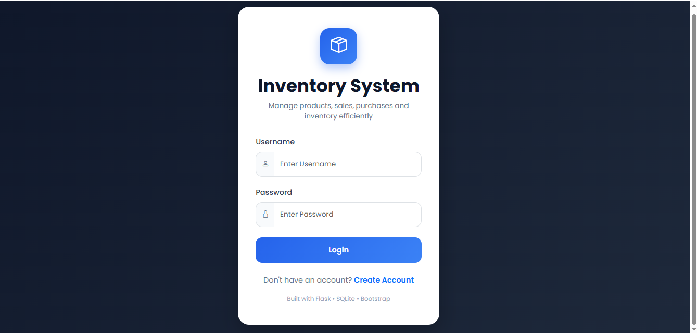
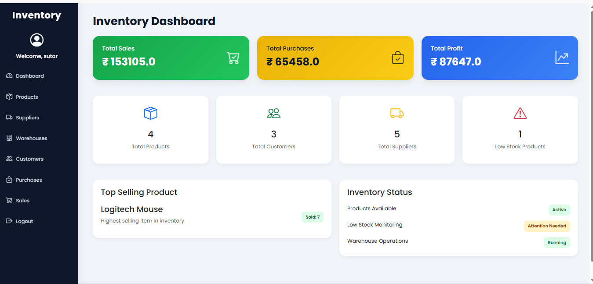

# Inventory Management System

A modern Inventory Management System built using Flask, SQLite, Bootstrap, and Jinja2.

## Features

* User Login & Registration
* Dashboard Analytics
* Product Management
* Supplier Management
* Warehouse Management
* Purchase Management
* Sales Billing System
* Inventory Alerts
* Responsive Admin Dashboard

## Technologies Used

* Python
* Flask
* SQLite
* Bootstrap 5
* HTML/CSS
* Jinja2

## Run Project

```bash
pip install -r requirements.txt
python app.py
```
## Project Screenshots

### Login Page


### Dashboard


### Products Page

